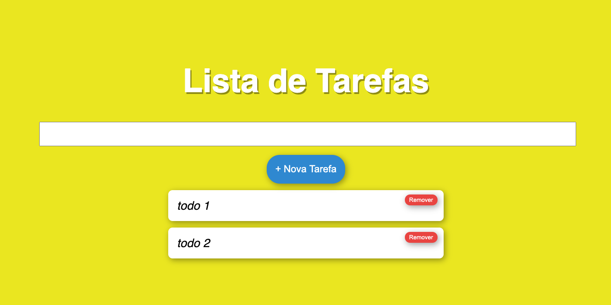

<h1 align="center">
   Lista de Tarefas - NextJS
</h1>

 

   <a href="#-technologies">Tecnologia</a>&nbsp;&nbsp;&nbsp;|&nbsp;&nbsp;&nbsp;
   <a href="#-projeto">Projeto</a>&nbsp;&nbsp;&nbsp;&nbsp;&nbsp;&nbsp;
 

    
 

 ## :rocket: Tecnologia

Esse projeto foi desenvolvido usando:

 - [Next JS](https://nextjs.org).

 ## 💻 Projeto

Um simples projeto de To-Do List para a disciplina de Modern Web do MBA - FIAP, utilizando NextJs

 ---
<h4 align="center">
   Code and coffee ☕
</h4>
